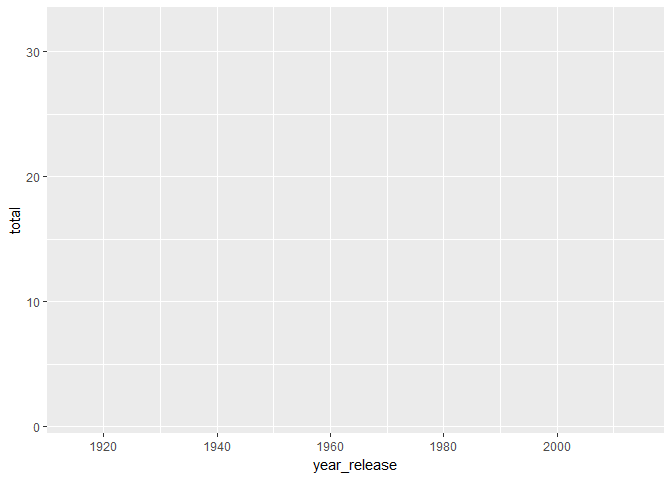
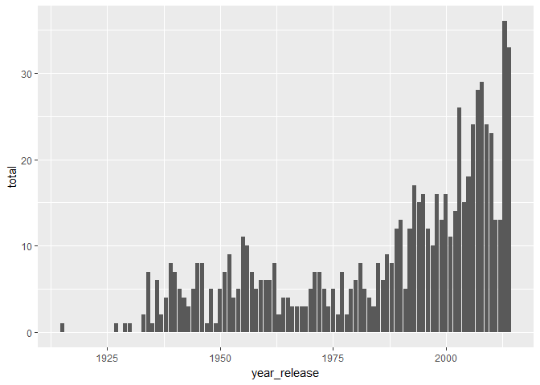
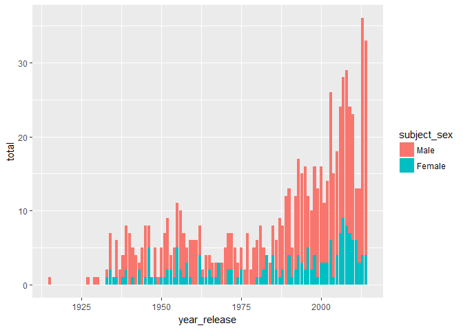
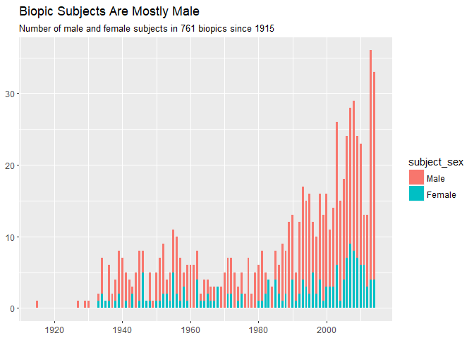
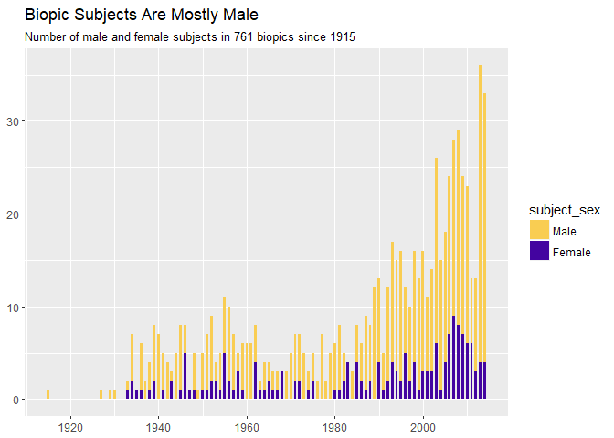
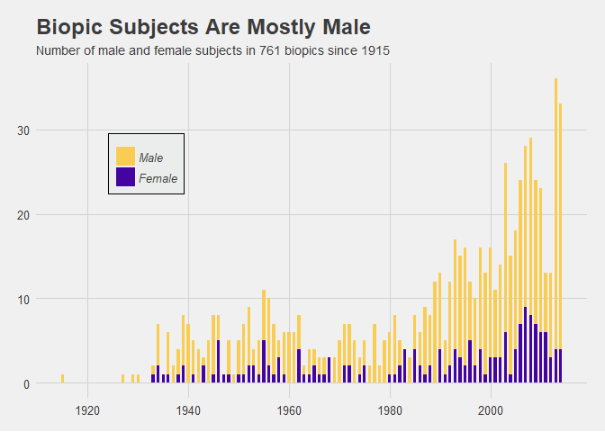

I've been busy working on applications for summer fellowships and internships, so this week my post will be a "rerun" of a tutorial I wrote for R Ladies- Twin Cities! If you want to look at the full tutorial, it's available [here](http://katiejolly.io/data-narratives-ggplot/) :)

I learned programming and data science partially through classes and partially through experimentation. Once I learned the basics, more and more of what I learned was through trying to recreate things that interested me. I've found that this has been particularly helpful for data visualization techniques! So, I'll walk you through how to recreate a graphic from the FiveThirtyEight article [‘Straight Outta Compton’ Is The Rare Biopic Not About White Dudes](https://fivethirtyeight.com/features/straight-outta-compton-is-the-rare-biopic-not-about-white-dudes/).


If you're new to `ggplot2`, I'd recommend reading through this [cheat sheet](https://www.rstudio.com/wp-content/uploads/2015/03/ggplot2-cheatsheet.pdf) first.

Setting up the project
======================

I'll use `tidyverse`, `ggplot2`, and `ggthemes` for this project.

``` r
# packages

library(tidyverse) 
library(ggplot2)
library(ggthemes)
```

The data comes from the FiveThirtyEight [data github](https://github.com/fivethirtyeight/data/) page, so it's easily accessible!

``` r
biopics <- read_csv("https://raw.githubusercontent.com/fivethirtyeight/data/master/biopics/biopics.csv")
```

The data is also available through the FiveThirtyEight R package. If you'd rather use that method, go for it! You'll get the same data.

``` r
library(fivethirtyeight)
data(biopics)
```

Now that we have the data, we need to wrangle it a bit.

We can use the `subject_sex` and `year_release` variables as our grouping variables. That way we can calculate the number of movies made about people of either sex per year.

``` r
gender_plotting <- biopics %>%
  group_by(subject_sex,year_release) %>%
  summarize(total = n()) # this is going to calculate the number of biopics about men and women separately for each year
```

The nice thing about this plot is that we don't need to do any other wrangling!

Let's get plotting!
===================

I like to think about `ggplot` plots as a series of steps. I'll recreate this graphic the same way so you can see how each step changes the graph.

### Setting up the axes

``` r
ggplot(data = gender_plotting, aes(x = year_release, y = total))
```



At this point, it doesn't look like there's any data on the plot. But, we need to set up our x and y aesthetics (axes) with the intended variables before we can add glyphs (bars) to the plot.

### Adding `geom`

``` r
ggplot(data = gender_plotting, aes(x = year_release, y = total)) +
  geom_bar(stat = "identity") # don't forget stat = "identity"
```



Now we've set the `geom` to bar, which gives us a barplot. `stat = "identity"` tells `ggplot` that we want to assign a particular y to each x. Without that argument, you'll get an error that says something along the lines of "you can't use a y aesthetic".

### Adding colors and a legend

One very noticeable difference between the plots is that ours needs color. Let's fix that!

``` r
# changing the stacking order

gender_plotting$subject_sex <- factor(gender_plotting$subject_sex, levels = c("Male", "Female"))


ggplot(data = gender_plotting, aes(x = year_release, y = total, fill = subject_sex)) +
  geom_bar(stat = "identity") 
```



If we hadn't changed the stacking order, `female` would have been on the top, which is backwards from the original plot.

Now we have most of the data on the plot. The next steps will talk more about the design aspects of the plot!

### Design

We won't be changing the code we've already written anymore. So, I'll introduce saving the plot as a variable. That makes it easier to use the plot over and over without having to type everything. Instead we will just add on the new parts.

``` r
# I changed the width of the bars here

g <- ggplot(data = gender_plotting, aes(x = year_release, y = total, fill = subject_sex)) +
  geom_bar(stat = "identity", width = 0.6) +
  labs(title = "Biopic Subjects Are Mostly Male", 
       subtitle = "Number of male and female subjects in 761 biopics since 1915", 
       x = NULL, 
       y = NULL)

g
```



``` r
# add the right colors now!

g <- g +
  scale_fill_manual(values = c("#f9cd52", "#4304a0")) # allows you to manually create a discrete scale

g
```



To find the right colors, I just guessed with google color picker. If you have a better guess for the colors, let me know!

Now I'll introduce the `ggthemes` package. It's a great way to incorporate tried-and-true designs. I like using the themes as a starting point and building from there! We'll use that method with this plot. And lucky for us, the typical FiveThirtyEight theme is already included in `ggthemes`.

``` r
# format the legend in a better way and add the fivethirtyeight theme!
g <- g +
  theme_fivethirtyeight() +
  theme(legend.position = c(.2,.7), # the axes are on a scale from 0 to 1, independent of the scale of the data
        legend.background = element_rect(fill="#eaedeb",
                                         size=0.5, 
                                         linetype="solid", 
                                         colour ="black"),
                                          
        legend.direction = "vertical",
        legend.title = element_blank(),
        legend.text = element_text(face = "italic"))
  
g
```



Nice! Now we have a presentation-ready plot based on the original FiveThirtyEight plot.

If you found this interesting, check out my [tutorial](http://katiejolly.io/data-narratives-ggplot)! It goes more in depth on everything I talked about here. I also appreciate any feedback. In particular, I'm trying to get better at explaining my work and thought process. Let me know if you have any tips!
